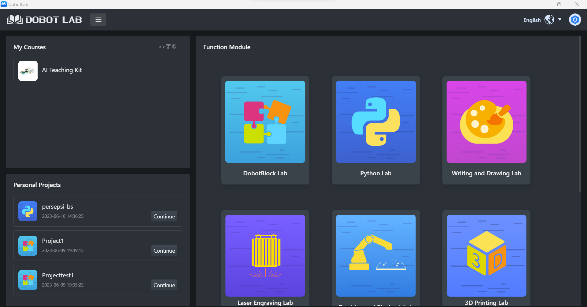
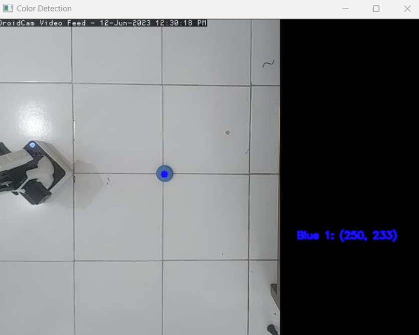

# Persepsi Robotika - Pick and Place dengan Dobot Magician
*Tujuan dari proyek ini adalah untuk mendeteksi lokasi suatu objek dan melakukan operasi pick-and-place. Dari perspektif implementasi, proyek ini membahas  Persepsi Robotika dengan OpenCV (Open-source Computer Vision Library).*

[DoBot Magician](https://www.dobot.cc/dobot-magician/product-overview.html) adalah sebuah robot lengan serbaguna yang dirancang untuk berbagai aplikasi. Robot ini dilengkapi dengan lengan robotik yang dapat bergerak dengan presisi tinggi dalam tiga sumbu. Selain itu, Dobot Magician juga memiliki kemampuan untuk mengganti end effector, seperti gripper (penggenggam) atau pen, sesuai dengan kebutuhan aplikasi. Fitur ini memungkinkan robot ini untuk melakukan berbagai tugas seperti pemindahan dan pengambilan objek, pemrograman robot, pencetakan 3D, dan pemrosesan otomatis dengan fleksibilitas yang tinggi.

[OpenCV (Open Source Computer Vision)](https://opencv.org/) adalah sebuah pustaka atau library kode sumber terbuka yang berfokus pada pengolahan citra dan penglihatan komputer. OpenCV menyediakan berbagai fungsi dan algoritma yang dapat digunakan untuk melakukan berbagai tugas seperti deteksi objek, pelacakan, segmentasi, analisis video, dan pengenalan pola. 

Dalam hal ini memfokuskan pengoperasian DoBot Magician melalui Python dengan  menggunakan [Dobot Lab](https://www.dobot-robots.com/products/education/magician.html). Menggunakan kode Python memberikan kebebasan yang lebih besar dalam mengontrol DoBot Magician, termasuk otomatisasi dan gerakan yang sangat terkalibrasi untuk tugas yang kompleks. 

## Daftar Isi
* [Memulai](#memulai)
* [Panduan](#panduan)
   * [Pengaturan Kamera](#Pengaturan-Kamera)
   * [Deteksi Objek dengan OpenCV](#Deteksi-Objek-dengan-OpenCV)
   * [Menghubungkan Robot](#Menghubungkan-Robot)
   * [Kalibrasi Robot dengan Kamera](#Kalibrasi-Robot-dengan-Kamera)
   * [Pick and Place](#Pick-and-Place)
* [Test Program](#test-program)
* [Conclusion](#conclusion)
* [Download Links](#download-links)


## Memulai

Untuk berkomunikasi dengan robot, kita memerlukan aplikasi [Dobot Lab](https://www.dobot-robots.com/products/education/magician.html). Selanjutnya pastikan kita juga menginstal 
[Python](https://www.python.org/) dan [OpenCV](https://opencv.org/) dalam lingkungan Python. Untuk IDE, kita dapat memanfaatkan menu Python Lab dalam aplikasi Dobot Lab.


## Panduan

Untuk memahami bagaimana alur kerja pick-and-place mari kita bagi menjadi tiga kategori berupa persepsi, kognisi, dan aksi. Persepsi merupakan bagaimana robot dapat melihat lingkungan sekitar. Secara default, Dobot Magician tidak memiliki sensor yang mengawasi kondisi eksternal robot. Oleh sebab itu, kita akan menggunakan kamera sebagai masukan citra yang terhubung ke komputer. Kognisi adalah bagaimana robot dapat memahami lingkungan sekitar. Kita melakukan pengolahan citra dengan menggunakan OpenCV dengan Python yang dapat melakukan berbagai operasi pengolahan citra, dalam projek ini berarti bagaimana objek dapat dideteksi berdasarkan klasifikasi warna. Aksi adalah pergerakan yang dilakukan robot setelah memahami lingkungan sekitar, dalam projek ini berarti bagaimana robot dapat bergerak dan mengambil objek.

### Deteksi Objek dengan OpenCV

OpenCV berisi metode yang dapat menerima berkas konfigurasi/bobot deteksi objek untuk berbagai model deteksi objek yang berbeda. OpenCV dapat menghasilkan ambang batas kepercayaan (confidence threshold) dan koordinat kotak pembatas (bounding box). Hal ini sangat berguna karena OpenCV memiliki metode yang dapat menerima koordinat kotak pembatas untuk dengan cepat menampilkan kotak di sekitar objek yang terdeteksi dan memberi label pada objek yang terdeteksi dengan sedikit kode yang sederhana dan bersih.

**Syntax**: 
```python
import numpy as np
import cv2

# Global variables to store the mouse coordinates and ignore flag
mouse_x = 0
mouse_y = 0
ignore_color_detection = False

# Global variables to store the object coordinates (blue,red,yellow)
xblu = 0
yblu = 0
xred = 0
yred = 0
xyel = 0
yyel = 0


# Function to handle mouse events
def mouse_callback(event, x, y, flags, param):
    global mouse_x, mouse_y, ignore_color_detection

    if event == cv2.EVENT_LBUTTONDOWN:
        # Store the mouse coordinates when left button is clicked
        mouse_x = x
        mouse_y = y
        ignore_color_detection = not ignore_color_detection  # Toggle the ignore flag

# Capturing video through webcam
webcam = cv2.VideoCapture("http://10.3.130.130:4747/video")

# Initialize last known mouse coordinates
last_mouse_x = 0
last_mouse_y = 0

# Start a while loop
while True:
    # Reading the video from the webcam in image frames
    _, imageFrame = webcam.read()

    # Using cv2.rectangle() method
    # Draw a rectangle of black color of thickness -1 px
    imageFrame = cv2.rectangle(imageFrame, (425, 0), (640, 480), (0, 0, 0), -1)

    # Convert the imageFrame to HSV color space
    hsvFrame = cv2.cvtColor(imageFrame, cv2.COLOR_BGR2HSV)

    # Set range for red color and define mask
    red_lower = np.array([136, 87, 111], np.uint8)
    red_upper = np.array([180, 255, 255], np.uint8)
    red_mask = cv2.inRange(hsvFrame, red_lower, red_upper)

    # Set range for yellow color and define mask
    yellow_lower = np.array([22, 93, 0], np.uint8)
    yellow_upper = np.array([45, 255, 255], np.uint8)
    yellow_mask = cv2.inRange(hsvFrame, yellow_lower, yellow_upper)

    # Set range for blue color and define mask
    blue_lower = np.array([80, 140, 110], np.uint8)
    blue_upper = np.array([120, 255, 255], np.uint8)
    blue_mask = cv2.inRange(hsvFrame, blue_lower, blue_upper)

    # Morphological Transform, Dilation for each color
    kernel = np.ones((5, 5), "uint8")

    # For red color
    red_mask = cv2.dilate(red_mask, kernel)
    contours, _ = cv2.findContours(red_mask, cv2.RETR_TREE, cv2.CHAIN_APPROX_SIMPLE)

    red_count = 0  # Variable to store red object count

    for pic, contour in enumerate(contours):
        area = cv2.contourArea(contour)
        if area > 300:
            x, y, w, h = cv2.boundingRect(contour)
            has_inner_object = False
            for inner_contour in contours:
                if inner_contour is not contour:
                    inner_area = cv2.contourArea(inner_contour)
                    inner_x, inner_y, inner_w, inner_h = cv2.boundingRect(inner_contour)
                    if (
                        inner_x > x
                        and inner_y > y
                        and inner_x + inner_w < x + w
                        and inner_y + inner_h < y + h
                        and inner_area < area
                    ):
                        has_inner_object = True
                        break
            if not has_inner_object:
                center = (x + w // 2, y + h // 2)
                xred = x + w // 2
                yred = y + h // 2
                cv2.circle(imageFrame, center, 5, (0, 0, 255), -1)
                red_count += 1
                # Print coordinates on the right side of the frame
                cv2.putText(imageFrame, f"Red {red_count}: {center}", (450, 10 + red_count * 30), cv2.FONT_HERSHEY_SIMPLEX, 0.5, (0, 0, 255), 2, cv2.LINE_AA)

    # For yellow color
    yellow_mask = cv2.dilate(yellow_mask, kernel)
    contours, _ = cv2.findContours(yellow_mask, cv2.RETR_TREE, cv2.CHAIN_APPROX_SIMPLE)

    yellow_count = 0  # Variable to store yellow object count

    for pic, contour in enumerate(contours):
        area = cv2.contourArea(contour)
        if area > 300:
            x, y, w, h = cv2.boundingRect(contour)
            has_inner_object = False
            for inner_contour in contours:
                if inner_contour is not contour:
                    inner_area = cv2.contourArea(inner_contour)
                    inner_x, inner_y, inner_w, inner_h = cv2.boundingRect(inner_contour)
                    if (
                        inner_x > x
                        and inner_y > y
                        and inner_x + inner_w < x + w
                        and inner_y + inner_h < y + h
                        and inner_area < area
                    ):
                        has_inner_object = True
                        break
            if not has_inner_object:
                center = (x + w // 2, y + h // 2)
                xyel = x + w // 2
                yyel = y + h // 2
                cv2.circle(imageFrame, center, 5, (0, 165, 255), -1)
                yellow_count += 1
                # Print coordinates on the right side of the frame
                cv2.putText(imageFrame, f"Yellow {yellow_count}: {center}", (450, 150 + yellow_count * 30), cv2.FONT_HERSHEY_SIMPLEX, 0.5, (0, 165, 255), 2, cv2.LINE_AA)

    # For blue color
    blue_mask = cv2.dilate(blue_mask, kernel)
    contours, _ = cv2.findContours(blue_mask, cv2.RETR_TREE, cv2.CHAIN_APPROX_SIMPLE)

    blue_count = 0  # Variable to store blue object count

    for pic, contour in enumerate(contours):
        area = cv2.contourArea(contour)
        if area > 300:
            x, y, w, h = cv2.boundingRect(contour)
            has_inner_object = False
            for inner_contour in contours:
                if inner_contour is not contour:
                    inner_area = cv2.contourArea(inner_contour)
                    inner_x, inner_y, inner_w, inner_h = cv2.boundingRect(inner_contour)
                    if (
                        inner_x > x
                        and inner_y > y
                        and inner_x + inner_w < x + w
                        and inner_y + inner_h < y + h
                        and inner_area < area
                    ):
                        has_inner_object = True
                        break
            if not has_inner_object:
                center = (x + w // 2, y + h // 2)
                xblu = x + w // 2
                yblu = y + h // 2
                cv2.circle(imageFrame, center, 5, (255, 0, 0), -1)
                blue_count += 1
                # Print coordinates on the right side of the frame
                cv2.putText(imageFrame, f"Blue {blue_count}: {center}", (450, 300 + blue_count * 30), cv2.FONT_HERSHEY_SIMPLEX, 0.5, (255, 0, 0), 2, cv2.LINE_AA)

    # Set the last known mouse coordinates
    last_mouse_x = mouse_x
    last_mouse_y = mouse_y

    # Show the frame
    cv2.imshow("Color Detection", imageFrame)

    # Check if 'q' is pressed on the keyboard
    if cv2.waitKey(1) & 0xFF == ord("q"):
        break

# Release the webcam and close all windows
webcam.release()
cv2.destroyAllWindows()
```

___



Pada frame diatas kita dapat melihat objek warna biru yang terdeteksi dan titik koordinatnya berdasarkan koordinat layar. Untuk mengakhiri frame, tekan tombol 'q'.

### Menghubungkan Robot
Untuk menghubungkan Dobot Magician ke komputer menggunakan Dobot Lab, Anda akan membutuhkan kabel USB dan sumber daya listrik. Pertama, pastikan Anda telah menginstal perangkat lunak Dobot Lab yang dapat diunduh dari situs resmi Dobot. Setelah itu, sambungkan kabel USB dari komputer ke port USB yang tersedia pada kontroler Dobot Magician. Pastikan Dobot Magician dalam keadaan mati sebelum Anda menyambungkannya ke sumber daya listrik menggunakan kabel power. Setelah kabel power terpasang, nyalakan Dobot Magician dengan menekan tombol daya di kontroler. Selanjutnya, buka perangkat lunak Dobot Lab di komputer dan cari opsi untuk menghubungkan dengan Dobot Magician, biasanya melalui menu "Connect" atau "Device". Pilih port koneksi yang sesuai dengan port USB yang Anda gunakan. Setelah terhubung, perangkat lunak akan menampilkan status koneksi yang menunjukkan bahwa Dobot Magician berhasil terhubung ke komputer.

### Kalibrasi Robot dengan Kamera
Untuk mengkalibrasi koordinat kamera dengan koordinat Dobot Magician, diperlukan pembuatan rumus konversi yang memungkinkan transformasi koordinat dari sistem kamera ke sistem robot. Proses kalibrasi ini melibatkan pengumpulan data koordinat pada kedua sistem, analisis data, dan perhitungan matriks transformasi.

Pertama, Anda perlu mengumpulkan data koordinat yang sesuai antara sistem kamera dan sistem robot. Ini dapat dilakukan dengan menggunakan teknik penandaan (marker) atau penginderaan objek tertentu pada kedua sistem. Setidaknya, tiga pasang koordinat yang sesuai harus ditentukan. Misalnya, tiga titik yang jelas terlihat pada objek di dunia nyata dicatat koordinatnya pada sistem kamera dan sistem robot.

Selanjutnya, menggunakan perangkat lunak pemrosesan gambar atau perangkat lunak matematika, Anda dapat melakukan analisis terhadap data yang dikumpulkan. Dalam analisis ini, berbagai metode transformasi seperti transformasi linier atau transformasi perspektif dapat diterapkan. Metode transformasi ini akan menghasilkan matriks transformasi yang menghubungkan koordinat kamera dengan koordinat robot.

Setelah matriks transformasi diperoleh, rumus konversi dapat dibuat. Rumus ini akan menerapkan transformasi pada koordinat kamera untuk menghasilkan koordinat robot. Biasanya, rumus konversi melibatkan perkalian matriks dan penambahan vektor.

### Pick and Place
Dobot Magician mempunyai fungsi bawaan yang dapat memindahkan posisi lengan dari satu poin ke poin yang lain. Berikut ini fungsi untuk memindahkan posisi lengan.

**Syntax**:
```python
magician.ptp(mode=0, x=endx, y=endy, z=-75, r=0)
```

Selain itu, Dobot Magician mempunyai fungsi bawaan yang dapat mengaktifkan edn effector suction cup dengan fungsi berikut.
**Syntax**:
```python
magician.set_endeffector_suctioncup(enable=True, on=True)
```


The enableControl argument enables or disables the pump. Suction enables outtake or intake. For more peripheral information, refer to the documentation.


There file named **DobotArm.py** contains wrapper functions which can be used as an example when making your own program.

## Test Program
After extracting the contents of the DobotDemoV2.0 folder we find a list of more folders. These are demos for the available languages which can be used to operate the Dobot. The one we are going to use in this guide is the DobotDemoForPython. In this folder we can find a file called **DobotControl.py**. This file contains a test program which uses a connection to the Dobot through USB which makes it do a couple of gestures. If you have installed Python and Magician Studio correctly you should be able to run the file without any problems, as long as you are connected to the Dobot through any of your USB ports. 

There is also an example program available for download on this github. This program includes some example functions for the API , this is not necessarily the only way to structure the program and the one you make will most probably not look similar to this one. Nevertheless, let's look into the functions.

The program starts with the creation of the object which we use to communicate with the Dobot. In the case of the example program the object is called ctrlBot and is of the type DobotArm. The constructor of the object takes in home coordinates for the Dobot. The constructor also calls the dobotConnect() function which connects to the Dobot and sets its various parameters.

*In many of the functions we can find the self object being passed around. In python this is used to refer to the object calling the function to be able to access the information specific to that object.*

**Syntax**:
```python
dobotConnect(self)
```

___

The function commandDelay() is called after each command is issued to the dobot. This is included so that the dobot is allowed to do its action before another command is issued.

**Syntax**:
```python
commandDelay(self, lastIndex)
```

___

toggleSuction() is an example function of how to initiate the peripheral connected to the dobot. In this example, we activate or deactivate the suction cup peripheral. It works much like a light switch, where the light is toggled on and off and keeps that state afterwards. This means that we only need to call the function to activate the peripheral, and then call it again once we're done with it.

**Syntax**:
```python
toggleSuction(self)
```

___

Main movement is done through the moveArmXY() function. The arguments for the function is the x and y positions which we want the dobot to travel to.

**Syntax**:
```python
moveArmXY(self, x,y)
```

___

As a utility a function that moves the arm to the selected home positions are also included.

**Syntax**:
```python
moveHome(self)
```

___

Last but not least, the function pickToggle() moves the arm up or down to the requested height. The only argument it takes is the height it moves too.

**Syntax**:
```python
pickToggle(self, itemHeight)
```

___

These functions will allow to do simple automation for the dobot by combining them, like in the manualmode function inside the **main.py** file. It allows for simple x,y grid movements and picking of items. 


### Conclusion
The capability of the Dobot Magician lays in your hands and what you can imagine. Automation, sorting, 3D printing and so on, it is a very fun machine to play with. I hope that this guide has helped you on your way to understanding how it works and to kick start you to start making the Dobot do whatever you want it to do. 


## Download Links
[Atom](https://atom.io/) - IDE referensed above.

[VS-Code](https://code.visualstudio.com/) - Alternative IDE

[Magician Studio](https://www.dobot.cc/downloadcenter/dobot-magician.html) - Dobot Application and Driver

[DobotDemoV2.0](https://www.dobot.cc/downloadcenter/dobot-magician.html?sub_cat=72#sub-download) - Code Examples

[Dobot API Manual](https://www.dobot.cc/downloadcenter/dobot-magician.html?sub_cat=72#sub-download) - Manual for API 

[Python](https://www.python.org/) - Language used in this guide

*Python installation instructions are available at their website. Other languages are also available but won't be present in this guide. The choice of IDE is completely in your hands.*

___

*Created by Hugo Nolte for Course PA1414 - Software Engineering Project*

*BTH - Blekinge Institute of Technology*

*2019*
